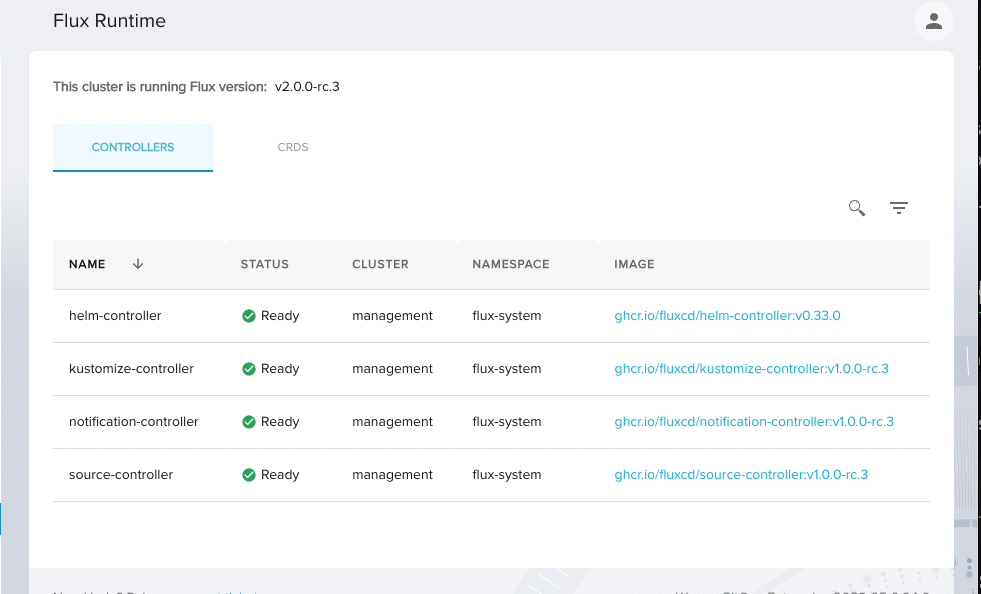

# Flux GA upgrade testing

## Goals

1. Validate weave gitops flux ga upgrade guide

## Setup

- Flux v0.4x: latest non ga release - https://github.com/fluxcd/flux2/releases/tag/v0.41.2
- Flux GA: latest ga release candidate - https://github.com/fluxcd/flux2/releases/tag/v2.0.0-rc.3
- Weave Gitops: latest ee release candidate - https://github.com/weaveworks/weave-gitops-enterprise/releases/tag/v0.23.0

Upgrade to lates

## User Stories

### I could use flux v0.4x with the latest weave gitops ee

```gherkin
Given weave gitops ee latest
When running flux v0.4x in management cluster
Then I could do all different flows
```

> Given weave gitops ee latest

Started by vanilla cluster with flux version is v0.3x and latest wge

)

> When running flux v0.4x in management cluster

Upgraded flux to latest non ga release

```
flux bootstrap github \
--owner=weaveworks \
--repository=clusters-config \
--branch=cluster-fluxga \
--namespace=flux-system \
--path=eksctl-clusters/clusters/fluxga \
--version v0.41.2 \
--personal
```


> Then I could do all different flows

### I could use flux ga with weave gitops ee

```gherkin
Given weave gitops ee latest
When running flux ga in management cluster
Then I could do all different flows
```

Upgraded to flux ga

```
flux bootstrap github \
--owner=weaveworks \
--repository=clusters-config \
--branch=cluster-fluxga \
--namespace=flux-system \
--path=eksctl-clusters/clusters/fluxga \
--personal
```



Upgraded happened but the following errors

```
◎ waiting for Kustomization "flux-system/flux-system" to be reconciled
✗ Kustomization/flux-system/shared-secrets dry-run failed, error: failed to prune fields:
failed add back owned items: failed to convert merged object at version kustomize.toolkit.fluxcd.io/v1: .spec.validation: field not declared in schema
```

Fix: remove removed field `the deprecated field .spec.validation was removed `
as suggested in https://github.com/fluxcd/flux2/releases/tag/v2.0.0-rc.1


