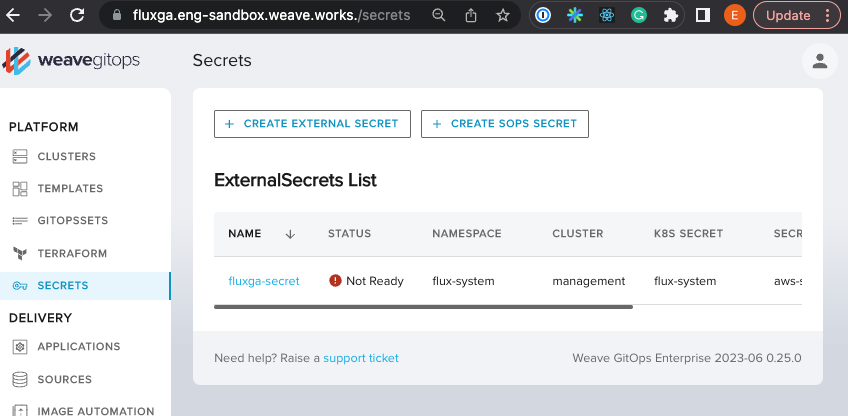
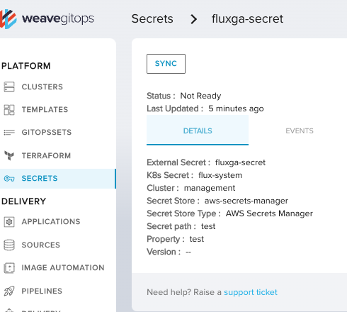

# Weave Gitops Secrets user journeys validation for FluxGA

## Can Create GitopsSet

```gherkin
Feature: Can Create GitopsSets with Wego and Flux GA
  As a weave gitops platform engineer
  I want to create a GitopsSets using Weave Gitops EE


  Scenario Outline:
    Given a gitopsset <resourceName> that generates <gvk>
    When deployed to weave gitops
    Then resources has been generated

    Examples:
      | resourceName   | gvk                                               |
      | gitopsset-ga   | kustomize.toolkit.fluxcd.io/v1/Kustomization      |
      | gitopsset-beta | kustomize.toolkit.fluxcd.io/v1beta2/Kustomization |

```

> Then a PR with the external secret manifest has been created

https://github.com/weaveworks/clusters-config/pull/440

## Can View GitopsSet

```gherkin
Feature: Can View External Secret with Wego and Flux GA
  As a weave gitops platform engineer
  I want to view an External secrets using Weave Gitops EE with FluxGA installed

  Scenario:
    Given a external secrets in management cluster
    When go to the secrets UI
    Then I could see the secret listed
    When I click into the secrets details
    Then I could see the external secrets details view
```

> Then I could see the secret listed



> Then I could see the external secrets details view



