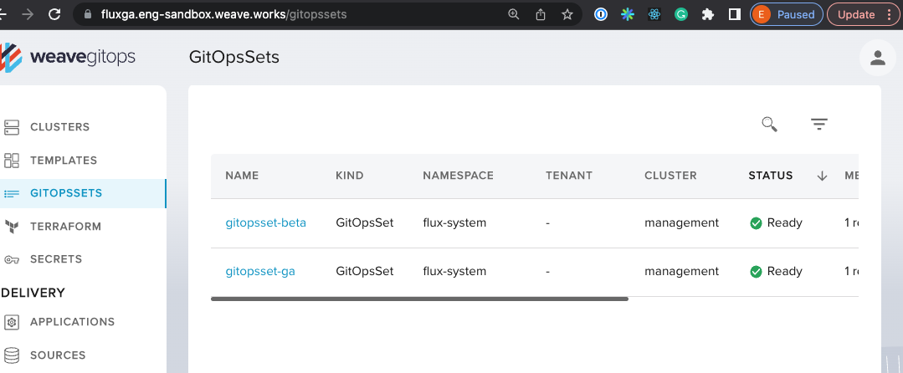

# Weave Gitops Secrets user journeys validation for FluxGA

## Can Create GitopsSet

```gherkin
Feature: Can Create GitopsSets with Wego and Flux GA
  As a weave gitops platform engineer
  I want to create a GitopsSets using Weave Gitops EE


  Scenario Outline:
    Given a gitopsset <resourceName> that generates <gvk>
    When deployed to weave gitops
    Then resources has been generated

    Examples:
      | resourceName   | gvk                                               |
      | gitopsset-ga   | kustomize.toolkit.fluxcd.io/v1/Kustomization      |
      | gitopsset-beta | kustomize.toolkit.fluxcd.io/v1beta2/Kustomization |

```

> Then a PR with the external secret manifest has been created

https://github.com/weaveworks/clusters-config/pull/444

https://fluxga.eng-sandbox.weave.works/gitopssets



## Can View GitopsSet

```gherkin
Feature: Can View GitopsSets with Wego and Flux GA
  As a weave gitops platform engineer
  I want to view different gitopssets versions via Weave Gitops EE with FluxGA

  Scenario Outline:
    Given a gitopsset <resourceName> that generates <gvk> is created
    When i click into gitopsets UI
    Then i see it listed
    When i click into the element
    Then i see its detail view without errors
    When i view the generated element via the UI
    Then i see its detail view without errors

    Examples:
      | resourceName   | gvk                                               |
      | gitopsset-ga   | kustomize.toolkit.fluxcd.io/v1/Kustomization      |
      | gitopsset-beta | kustomize.toolkit.fluxcd.io/v1beta2/Kustomization |
```

>     Then i see it listed


>     Then i see it its detail view without errors


>     Then i see it its detail view without errors


