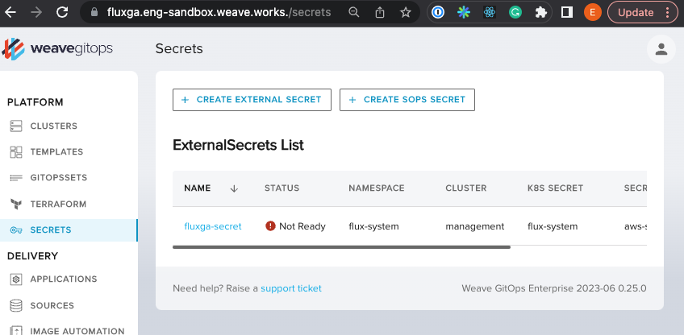
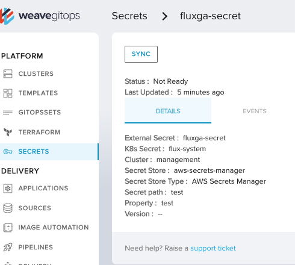

# Weave Gitops Secrets user journeys validation for FluxGA

## Can Create SOPS Secret

```gherkin
Feature: Can Create Secrets with Wego and Flux GA
  As a weave gitops platform engineer
  I want to create a SOPS secrets using Weave Gitops EE

  Background:
    Given sops infrastructure created via scripts ./docs/fluxga-validation/journeys/scripts/generate-sops.sh and
    And /eksctl-clusters/clusters/fluxga/validation-create-secrets-sops.yaml

  Scenario Outline:
    Given a sops kustomization <resourceName> from <gvk>
    When created <secretName> sops secret via the UI selecting kustomization <resourceName> for encryption
    Then a PR with the encrypted secret has been created to the secrets path in the

    When PR merged and reconciled
    Then kubernetes secret has been created with the expected value

    Examples:
      | resourceName            | gvk                                               | secretName       |
      | sops-kustomization-ga   | kustomize.toolkit.fluxcd.io/v1/Kustomization      | sops-secret-ga   |
      | sops-kustomization-beta | kustomize.toolkit.fluxcd.io/v1beta2/Kustomization | sops-secret-beta |
```

> Then a PR with the encrypted secret has been created to the secrets path in the

https://github.com/weaveworks/clusters-config/pull/454


> Then kubernetes secret has been created with the expected value


```bash
➜  clusters-config git:(cluster-fluxga) k get secret -n default                                                                            <aws:sts>
NAME      TYPE     DATA   AGE
test      Opaque   1      3m28s
test-ga   Opaque   1      63s
```

## Can Create External Secret

```gherkin
Feature: Can Create Secrets with Wego and Flux GA
  As a weave gitops platform engineer
  I want to create a External secrets using Weave Gitops EE

  Background:
    Given external secrets infrastructure created following https://docs.gitops.weave.works/docs/secrets/getting-started/#add-the-secrets-infra
    And create aws secrets manager secrets store

  Scenario:
    When created a "fluxga-secret" external secret via the UI
    Then a PR with the external secret manifest has been created
```

> Then a PR with the external secret manifest has been created

https://github.com/weaveworks/clusters-config/pull/440

## Can View Secret

```gherkin
Feature: Can View External Secret with Wego and Flux GA
  As a weave gitops platform engineer
  I want to view an External secrets using Weave Gitops EE with FluxGA installed

  Scenario:
    Given a external secrets in management cluster
    When go to the secrets UI
    Then I could see the secret listed
    When I click into the secrets details
    Then I could see the external secrets details view
```

> Then I could see the secret listed



> Then I could see the external secrets details view



